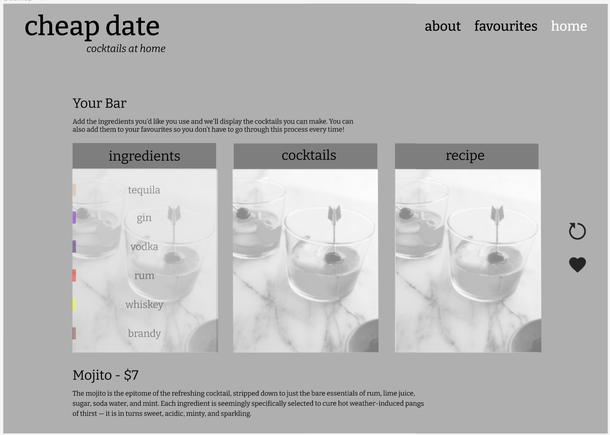
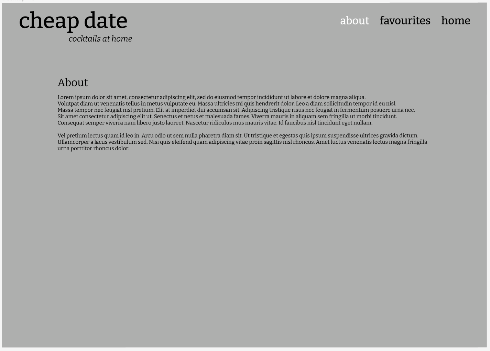
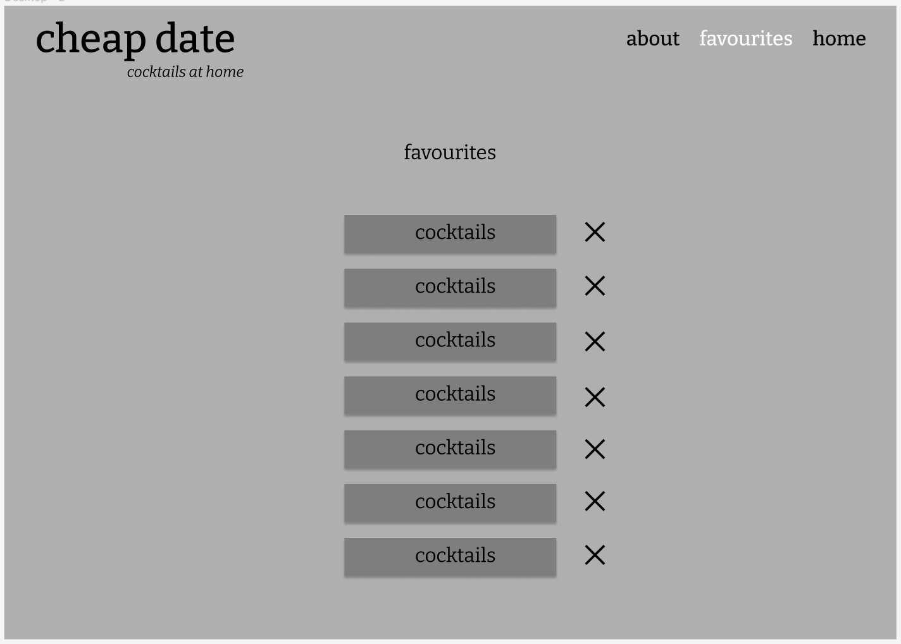
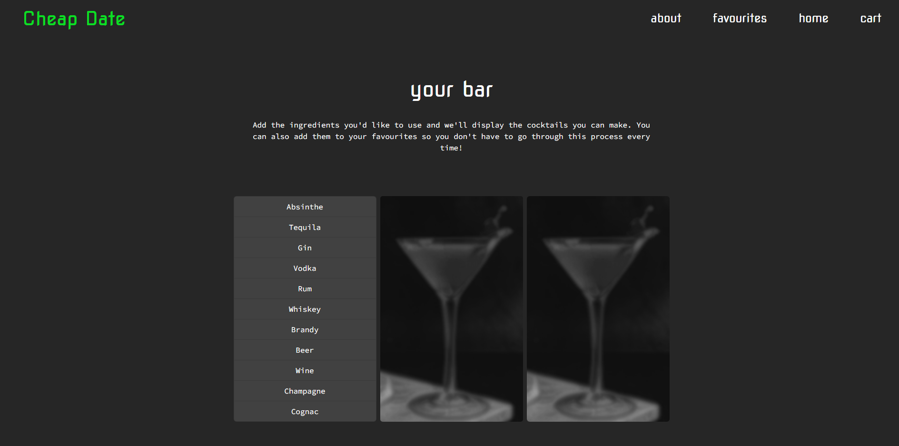
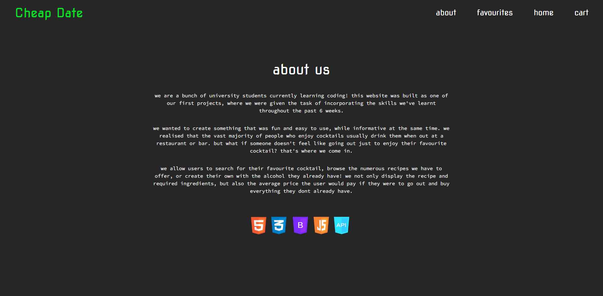
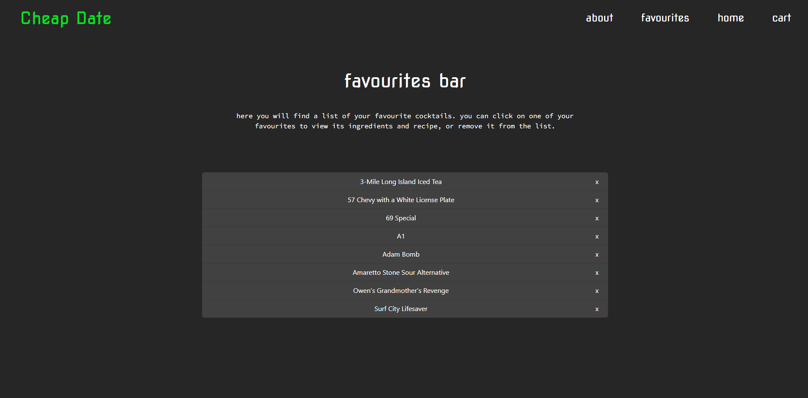

# Cheap Date - *cocktails from home*

## MVP (minimum viable product)

Who is your audience? - People at home, aged over 18, wanting to experiment,
What is the problem that the product will address? - Recipe on how to make, cost involved,
How does the product solve that problem? - Informs how to make correct cocktails at home

## Description

As a person wanting to experiment with cocktails at home, I want to view a recipe and ingredients for my desired cocktail, so that I am informed on how to make it and how much it will cost.

## Grading Requirements

```
### Technical Acceptance Criteria: 25%
    - Application uses at least two server-side APIs
    - Application uses client-side storage to store persistent data.
    - Application doesn't use JS alerts, prompts, or confirms (uses modals instead).
    - Application uses a CSS framework other than Bootstrap.
    - Application is interactive (accepts and responds to user input)
    
### Concept: 10%
    - Concept should be a unique and novel idea.
    - Your group should clearly and concisely articulate your project idea.
    
### Deployment: 20%
    - Application Deployed at live URL and loads with no errors.
    - Application GitHub URL submitted.
    
### Repository Quality: 10%
    - Repository has a unique name
    - Repository follows best practices for file structure and naming conventions.
    - Repository follows best practices for class/id naming conventions, indentation, quality comments, etc.
    - Repository contains multiple descriptive commit messages.
    - Repository contains a quality README file with description, scsreenshot, and link to deployed application.
    
### Application Quality: 15%
    - Application user experience is intuitive and easy to navigate.
    - Application user interface style is clean and polished.
    - Application is responsive.
    
### Presentation: 10%
    - Your group should present using a slide deck.
    - Every group member should speak during the presentation.
    - Your presentation should follow the Prohject Presentation Template.
    
### Collaboration: 10%
    - There are no major disparities in the number of GitHub contributions between group members.
    
```
## Prototype






## Screenshots






## APIs used in this project

1. [The Cocktail Database](https://www.thecocktaildb.com/api.php?ref=apilist.fun)
2. [Spoonacular](https://spoonacular.com/food-api)

## Breakdown of tasks:

- **HTML** - [Ruben](https://github.com/r-r-i) & [Tanel](https://github.com/kreatifbob)
- **CSS** - [Ruben](https://github.com/r-r-i) & [Tanel](https://github.com/kreatifbob)
- **BOOTSTRAP** - [Ruben](https://github.com/r-r-i) & [Tanel](https://github.com/kreatifbob)
- **APIs** - [Vanessa](https://github.com/NessJade96) & [Nate](https://github.com/vesnathan)
- **JAVASCRIPT** - [Vanessa](https://github.com/NessJade96) & [Nate](https://github.com/vesnathan)
- **JQUERY** - [Vanessa](https://github.com/NessJade96) & [Nate](https://github.com/vesnathan)

## Developing

    To download this repoository for further development, simply create and enter a folder on your local machine
    and run the following command in bash terminal: `git clone`
    
## Features to be implemented in upcoming patches

- Checkout option for users to pay for ingredients and have them delivered.
- Allergens and dietary specification indicator next to each ingredient.
- Share button for users to link their personalised favourites or about page.
- Recommended tab or pop-out on page visit. Top cocktails added to favourites list that day.
- Feedback or contact page for users to provide feedback on UXUI or application bugs.

## Configuration

    none

## Contributing

    This is a private site, no contributions accepted.

## Links

    Deployed URL: [Cheap Date](https://nessjade96.github.io/cheap-date/index.html)
    GitHub Repository URL: [Cheap Date Repository](https://github.com/NessJade96/cheap-date)

## Licensing

    Copyright. Do not use code without permission of the copyright holder.
