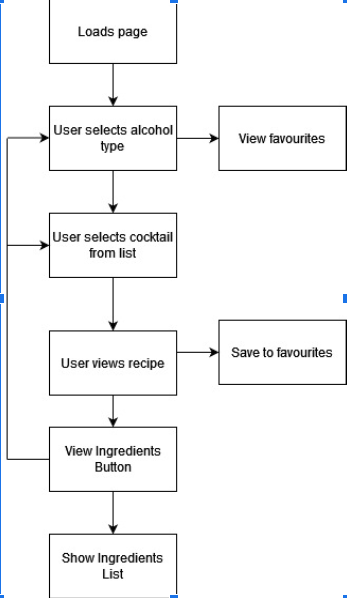

## Cheap Date - *cocktails from home*
Created by Ruben Iacono, Nathan Loudon, Tanel Colak, and Vanessa Bloom

## MVP (minimum viable product)

Who is your audience? - People at home, aged over 18, wanting to experiment,
What is the problem that the product will address? - Recipe on how to make, cost involved,
How does the product solve that problem? - Informs how to make correct cocktails at home

## Description

As a person wanting to experiment with cocktails at home, I want to view a recipe and ingredients for my desired cocktail, so that I am informed on how to make it and how much it will cost.

## Prototype

## Screenshots

## APIs used in this project

1. [The Cocktail Database](https://www.thecocktaildb.com/api.php?ref=apilist.fun)
2. [Woolworths] 

## Breakdown of tasks:

- **HTML** - [Ruben](https://github.com/r-r-i) & [Tanel](https://github.com/kreatifbob)
- **CSS** - [Ruben](https://github.com/r-r-i) & [Tanel](https://github.com/kreatifbob)
- **BOOTSTRAP** - [Ruben](https://github.com/r-r-i) & [Tanel](https://github.com/kreatifbob)
- **APIs** - [Vanessa](https://github.com/NessJade96) & [Nate](https://github.com/vesnathan)
- **JAVASCRIPT** - [Vanessa](https://github.com/NessJade96) & [Nate](https://github.com/vesnathan)
- **JQUERY** - [Vanessa](https://github.com/NessJade96) & [Nate](https://github.com/vesnathan)

## Developing

    To download this repository for further development, simply create and enter a folder on your local machine
    and run the following command in bash terminal: `git clone`
    
## Features to be implemented in upcoming patches

- Checkout option for users to pay for ingredients and have them delivered.
- Allergens and dietary specification indicator next to each ingredient.
- Share button for users to link their personalised favourites or cart page.
- Recommended tab or pop-out on page visit. Top cocktails added to favourites list that day.
- Feedback or contact page for users to provide feedback on UXUI or application bugs.

## Configuration

    none

## Contributing

    This is a private site, no contributions accepted.

## Links

    Deployed URL: [Cheap-Date](https://nessjade96.github.io/cheap-date/index.html)
    GitHub Repository URL: [Cheap-Date-Repository](https://github.com/NessJade96/cheap-date)

## Licensing

    Copyright. Do not use code without permission of the copyright holder.
